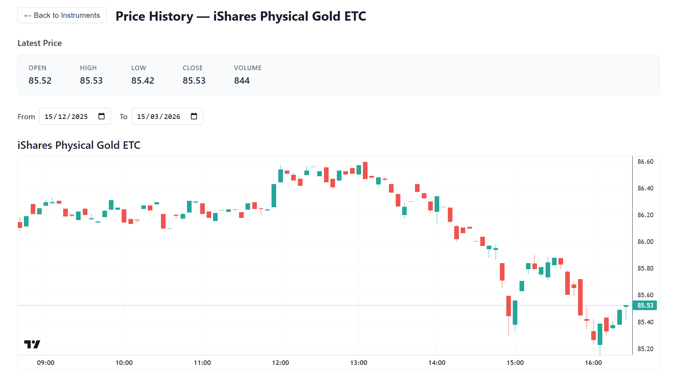

# 📈 Market Data Platform

[](https://github.com/marcoalc-uco/market_data_platform/actions/workflows/ci-backend.yml)
[](https://github.com/marcoalc-uco/market_data_platform/actions/workflows/ci-frontend.yml)



Full-stack platform for ingesting, storing, and visualizing financial market data (stocks, indices, crypto). Built with **FastAPI**, **React**, **PostgreSQL**, **Grafana**, and a local **Ollama LLM** with RAG.

```
Browser (:5173 dev / :80 prod)
    |
    v
  Frontend --- React 18 + Vite + TanStack Query + ApexCharts
    |
    v  HTTP :8000
  Backend ---- FastAPI + SQLAlchemy + Alembic + APScheduler
    |      |
    |      v  :11434 (internal)
    |    Ollama ---- local LLM (qwen2.5-coder:3b)
    |      |
    |      v
    |    ChromaDB -- vector store (RAG document chunks)
    |
    v  :5432
  PostgreSQL - TimescaleDB-ready schema
    |
    v  direct read
  Grafana ---- OHLCV dashboards (:3000)
```

---

## ✨ Features

- **ETL pipeline** -- Automated ingestion from Yahoo Finance (OHLCV data) via APScheduler; daily run at 16:30 UTC, intraday every 5 min; indices handled gracefully (no intraday data)
- **REST API** -- Full CRUD on instruments + price queries with pagination, OpenAPI docs at `/docs`
- **JWT authentication** -- Secure login with bcrypt-hashed passwords and HS256 tokens
- **React dashboard** -- Instruments table with filters/CRUD, price charts (candlestick / line / mountain), date range picker
- **RAG chat assistant** -- Per-instrument chat powered by a local Ollama LLM (zero cost, no external API); upload PDFs/docs to augment context via ChromaDB vector search; streamed responses via SSE
- **Grafana dashboards** -- Multi-instrument candlestick + volume charts with cross-filtering by asset type
- **Docker orchestration** -- One command to start everything (prod + dev hot-reload modes); Ollama models pulled automatically on first start via init container

---

## 🚀 Quick Start

### Prerequisites

- **Docker** + **Docker Compose** v2
- **Git**

### 1. Clone and configure

```bash
git clone <repo-url>
cd market_data_platform

# Copy environment template
cp .env.example .env

# Generate a real secret key
# Linux/Mac:
openssl rand -hex 32
# Then paste the output as SECRET_KEY value in .env
```

### 2. Set up admin password

The admin password hash is loaded via Docker Secrets. Create the secret file:

```bash
mkdir -p secrets

# Generate a bcrypt hash for your password:
python -c "import bcrypt; print(bcrypt.hashpw(b'your-password-here', bcrypt.gensalt()).decode())" > secrets/admin_password_hash.txt
```

### 3. Start the platform

```bash
# Production-like mode (all services containerized)
make up

# Development mode (hot-reload for backend + frontend)
make up-dev
```

### 4. Access services

| Service        | URL                        | Notes                  |
| -------------- | -------------------------- | ---------------------- |
| Frontend       | http://localhost:80        | Production (Nginx)     |
| Frontend (dev) | http://localhost:5173      | Vite dev server        |
| Backend API    | http://localhost:8000      | FastAPI                |
| API Docs       | http://localhost:8000/docs | Swagger UI             |
| Grafana        | http://localhost:3000      | Default: admin / admin |
| PostgreSQL     | localhost:5432             | DB: market_data        |

---

## 💡 Use Cases

### Browse and manage instruments

1. Log in at `http://localhost` with your admin credentials
2. The instruments table loads automatically -- filter by asset type (stock/index/crypto) or active status
3. Create new instruments via the "Add" button, or edit/delete existing ones
4. The ETL scheduler automatically ingests OHLCV data for all active instruments

### View price charts

1. Click any instrument row to open its price chart
2. Switch chart type with the toolbar: **Candlestick**, **Line**, or **Mountain** (area with gradient fill)
3. Use the date range picker to zoom into a specific period
4. The latest price summary card shows the most recent OHLCV snapshot

### Chat with the AI assistant (RAG)

1. Open any instrument price page — the chat panel appears below the chart
2. Ask questions about the instrument: price trends, volatility, context
3. Optionally upload a PDF, Markdown, or text document (e.g. a fund factsheet or earnings report) to enrich the assistant's context
4. The local Ollama model (no API key required, zero cost) streams a response using both the recent OHLCV data and the uploaded document chunks retrieved via semantic search

### Monitor via Grafana

1. Open `http://localhost:3000` and log in (admin/admin)
2. Navigate to **Dashboards** > **Market Data - Multi-Instrument by Asset Type**
3. Select an asset type to filter, then pick one or more symbols
4. Compare instruments side-by-side with candlestick + volume panels

### Trigger manual ingestion

```bash
# Via API (requires JWT token)
curl -X POST http://localhost:8000/api/v1/ingest/run \
  -H "Authorization: Bearer <token>"
```

---

## Project Structure

```
market_data_platform/
├── market_data_backend_platform/   <- Python/FastAPI backend
│   ├── src/                        <- Application code
│   ├── tests/                      <- Unit + integration tests
│   ├── alembic/                    <- Database migrations
│   ├── docker/                     <- Dockerfile + Grafana provisioning
│   └── docs/                       <- PRD, QA protocol, architecture, Grafana guide
│
├── market_data_frontend_platform/  <- React/Vite frontend
│   ├── src/                        <- Components, hooks, pages, API layer
│   ├── tests/                      <- Vitest test setup
│   ├── Dockerfile                  <- Multi-stage (builder + Nginx)
│   └── docs/                       <- PRD, QA protocol, architecture
│
├── docs/                           <- System-level architecture
├── tests/e2e/                      <- End-to-end tests (Playwright)
├── docker-compose.yml              <- Production orchestration
├── docker-compose.dev.yml          <- Dev hot-reload overrides
├── Makefile                        <- Root automation
└── .env.example                    <- Environment template
```

---

## Available Commands

Run `make help` to see all commands. Key ones:

| Command                 | Description                              |
| ----------------------- | ---------------------------------------- |
| `make up`               | Start all services (production-like)     |
| `make up-dev`           | Start with hot-reload                    |
| `make down`             | Stop all services                        |
| `make down-clean`       | Stop and remove volumes (fresh start)    |
| `make logs`             | Follow logs for all services             |
| `make backend-test`     | Run backend unit tests                   |
| `make backend-test-cov` | Backend tests with coverage report       |
| `make backend-lint`     | Run backend linting (black, isort, mypy) |
| `make frontend-test`    | Run frontend tests (Vitest)              |
| `make frontend-lint`    | Run frontend linting (ESLint + Prettier) |
| `make frontend-build`   | Build frontend for production            |
| `make check-all`        | Run all quality checks                   |

---

## Tech Stack

### Backend

| Layer      | Technology           |
| ---------- | -------------------- |
| Framework  | FastAPI + Uvicorn    |
| ORM        | SQLAlchemy 2.x       |
| Migrations | Alembic              |
| Validation | Pydantic 2.x         |
| Auth       | JWT (PyJWT) + bcrypt |
| Scheduler  | APScheduler          |
| Database   | PostgreSQL 16        |
| LLM        | Ollama (local)       |
| Vector DB  | ChromaDB             |
| Logging    | structlog (JSON)     |
| Testing    | pytest + httpx       |
| Quality    | black + isort + mypy |
| Python     | 3.14+                |

### Frontend

| Layer        | Technology                 |
| ------------ | -------------------------- |
| Framework    | React 18                   |
| Build        | Vite 5                     |
| Server state | TanStack Query v5          |
| Charts       | ApexCharts (candlestick / line / mountain) |
| Routing      | react-router-dom v6        |
| Styling      | CSS Modules                |
| Testing      | Vitest + React Testing Lib |
| Quality      | ESLint 8 + Prettier        |
| Production   | Nginx (Alpine) + SSE proxy |

---

## API Overview

Full OpenAPI documentation available at `http://localhost:8000/docs` when the backend is running.

| Method | Endpoint                                | Auth | Description          |
| ------ | --------------------------------------- | ---- | -------------------- |
| GET    | `/health`                               | No   | Health check         |
| POST   | `/api/v1/auth/token`                    | No   | Login (returns JWT)  |
| GET    | `/api/v1/instruments`                   | Yes  | List instruments     |
| GET    | `/api/v1/instruments/{id}`              | Yes  | Get instrument       |
| POST   | `/api/v1/instruments`                   | Yes  | Create instrument    |
| PUT    | `/api/v1/instruments/{id}`              | Yes  | Update instrument    |
| DELETE | `/api/v1/instruments/{id}`              | Yes  | Delete instrument    |
| GET    | `/api/v1/prices/{instrument_id}`        | Yes  | Get OHLCV prices     |
| GET    | `/api/v1/prices/{instrument_id}/latest` | Yes  | Get latest price     |
| POST   | `/api/v1/ingest/run`                    | Yes  | Trigger ETL manually |
| POST   | `/api/v1/chat/{instrument_id}`          | Yes  | Stream chat response (SSE) |
| POST   | `/api/v1/chat/{instrument_id}/documents`| Yes  | Upload document for RAG    |
| GET    | `/api/v1/chat/{instrument_id}/documents`| Yes  | List uploaded documents    |

---

## Environment Variables

Three `.env.example` files exist at different levels:

| File                                         | Scope                        | Key variables                                                  |
| -------------------------------------------- | ---------------------------- | -------------------------------------------------------------- |
| `.env.example` (root)                        | Docker Compose orchestration | `POSTGRES_*`, `GRAFANA_*`, `SECRET_KEY`, `ADMIN_EMAIL`         |
| `market_data_backend_platform/.env.example`  | Local backend development    | `DB_HOST`, `DATABASE_URL`, `CORS_ORIGINS`, `SCHEDULER_ENABLED` |
| `market_data_frontend_platform/.env.example` | Local frontend development   | `VITE_API_URL`                                                 |

When running via Docker Compose, only the root `.env` is needed. Service-specific `.env` files are for local development outside containers.

---

## 🧪 Testing

### Backend (pytest)

```bash
make backend-test          # Unit tests
make backend-test-all      # Unit + integration
make backend-test-cov      # With coverage report (min 85%)
```

### Frontend (Vitest)

```bash
make frontend-test         # All tests
make frontend-lint         # ESLint + Prettier check
```

### Quality gates

```bash
make check-all             # Backend lint + tests, frontend lint + tests
```

---

## 📚 Documentation

Detailed documentation lives in each service's `docs/` directory:

| Document          | Backend | Frontend | Description                                     |
| ----------------- | ------- | -------- | ----------------------------------------------- |
| `architecture.md` | Yes     | Yes      | Component design, data flows, project structure |
| `PRD.md`          | Yes     | Yes      | Feature scope and API contracts                 |
| `QA_PROTOCOL.md`  | Yes     | Yes      | Test commands and coverage targets              |
| `GRAFANA.md`      | Yes     | --       | Dashboard guide, SQL queries, troubleshooting   |

System-level architecture: `docs/architecture.md` (monorepo root).

---

## License

See [LICENSE](./LICENSE).
